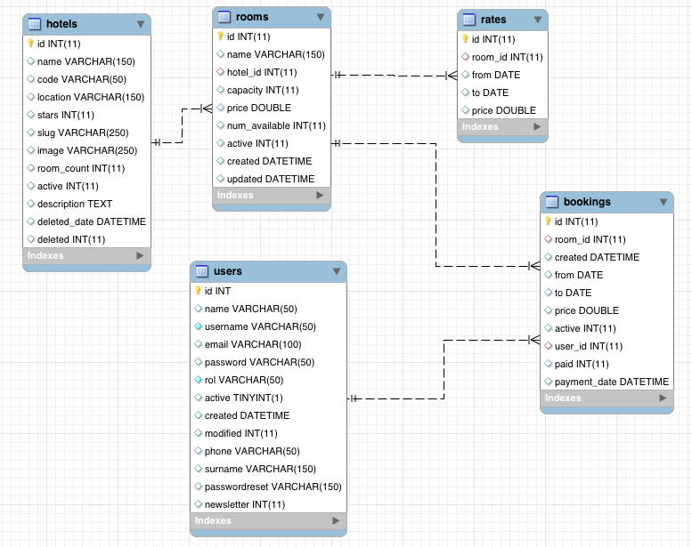

# booking-test-app


## Controllers

### Main

* home()
	Show the home of website

### Hotels 

* index()
	List Hotels (paginated)
* search( $searchParams[...])
	Search Hotels and avaliability		
* show( $id/$slug )
	Show Hotel information

### Bookings

* book( $hotel_id, $bookingParams[...])
	Starts booking (checks availibity and mark as "pending" the new booking)
* payment( $booking_id)
	when the reserve requires a payment method
* confirm ( $booking_id )
	Changes status to "confirmed" in booking
* mybookings() 
	show a list of booking (filtered by logged user)

### Users

* register()
* rememberPassword()
* login()
* logout()
* profile()
	View and edit the users profile

## NOTES

	We need a special table or search engine for the searchs. 

	Example: when a user make a booking, or a hotel is updated (room data), we must call to a background task (with gearman, beanstalk, ZeroMQ, ...) witch generates a plain (or as a noSQL document) with all the relevant data of the hotel (stars, address, ...) and a list of not available days for every type of room. With this method, all the searchs can be in a Search Engine (ElasticSearch, Solr, ...) searching documentos with "available" rooms.

	This document must contain the list of not available days (only this days), and que search would be like  (pseudocode)

Seaching Hotel 1-3 stars, 2 pax, from: 2014-12-01 to 2014-12-03, city: Seville
```
	stars.between: { 1,3}
	and
	location: "Seville"
	and 
	notavailabledate.mustno: "2014-12-01" 
	and 
	notavailabledate.mustno: "2014-12-02" 
	and 
	notavailabledate.mustno: "2014-12-03"
	and maxperson: { '>=': 2} 
```


## Database Schema
 


View: [SQL File](docs/database_schema.sql)

## DEMO

Url : http://booking.besbello.com 


